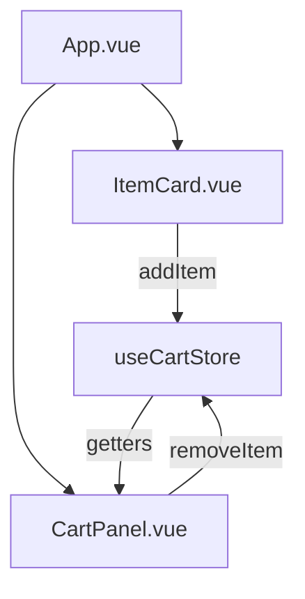

# Архітектура (блок-схема)

Mermaid-діаграма (якщо ваш редактор підтримує mermaid):

Пояснення:
- App.vue — головний компонент, тримає список продуктів та стан показу панелі.
- ItemCard — "тупий" компонент для відображення одиниць (використовується для товарів і для рядків кошика).
- CartPanel — панель, що з'являється; показує список товарів із стору, геттери totalAmount і totalItemsCount.
- useCartStore — Pinia store для зберігання та обробки товарів.
